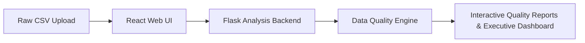

# 🔍 DataLens — Data Quality Impact Investigator

[](https://www.python.org/)
[](https://flask.palletsprojects.com/)
[](https://react.dev/)
[](https://vitejs.dev/)
[](LICENSE)

> An intelligent data quality investigation platform that detects data anomalies, evaluates operational risks, calculates composite dataset health scores, and delivers actionable business recommendations.

---

## 🎯 Problem Statement

In data engineering and analytics pipelines, poor data quality leads to unreliable business intelligence, skewed reporting, and failed machine learning models. 

Traditional statistical tools only report raw anomaly metrics:
- *"Column Salary has 8% null values."*
- *"Dataset contains 12 duplicate records."*

These raw numbers leave non-technical stakeholders asking:
- **How critical are these data issues?**
- **What financial or operational risks could they cause?**
- **How should data teams prioritize and fix these errors?**

**DataLens bridges this gap.** Instead of just printing technical stats, DataLens investigates data anomalies, measures their business severity, calculates a composite health score, and provides step-by-step remediation guidance.

---

## 💡 Product Overview

DataLens is a full-stack data quality investigation solution designed for data analysts, analytics engineers, and decision-makers. It turns unorganized raw CSV data into clear, executive-ready quality reports with interactive visualizations and automated risk assessments.



---

## ✨ Key Features

- **🚀 One-Command Launcher (`python run.py`)**  
  Starts the entire application (Flask backend, React frontend, health readiness checks, and web browser) automatically with a single command.

- **📁 Dataset Upload & Live Inspection**  
  Drag-and-drop CSV file uploader featuring live metadata extraction, file size checking, and structural data preview.

- **📊 Comprehensive Dataset Overview**  
  Displays dataset dimensions, memory footprint, attribute category breakdown, and overall health status.

- **⚠️ Missing Value Analysis**  
  Identifies missing data across all attributes, measures null percentages, calculates column severity, and details operational impact.

- **🔄 Duplicate Record Detection**  
  Detects duplicate entity records, computes dataset inflation rates, and highlights sample duplicate pairs for inspection.

- **📐 Datatype Validation**  
  Checks column datatypes against expected schemas to flag type mismatches, parsing warnings, and formatting errors.

- **📈 Outlier & Anomaly Detection**  
  Uses statistical Interquartile Range (IQR) techniques to highlight continuous numerical outliers and extreme boundary values.

- **🎯 Business Impact & Recommendation Engine**  
  Translates data errors into risk assessments and generates clear, actionable remediation steps.

- **📊 Executive Master Dashboard**  
  Presents a Composite Health Score (0–100), dataset status rating (*Excellent, Good, Average, Poor, Critical*), priority triage queue, and executive insights summary.

---

## ⚡ Quick Start (One-Command Launcher)

Launch the complete DataLens platform with a single command:

```bash
python run.py
```

### Automatic Startup Sequence

```text
----------------------------------------
Starting DataLens...
----------------------------------------

✓ Checking Python Environment
✓ Checking Virtual Environment
✓ Checking Flask
✓ Checking Node.js
✓ Checking npm Packages
✓ Starting Flask Backend
✓ Starting React Frontend
✓ Opening Browser

----------------------------------------
DataLens Started Successfully
----------------------------------------

Backend:  http://127.0.0.1:5000
Frontend: http://localhost:3000
```

---

## 🏗 High-Level Architecture

```text
Browser User Interface
         │
         ▼
  React Frontend
         │
         ▼
   Flask Backend
         │
         ▼
  Analysis Engine
         │
         ▼
 Quality Reports & Dashboard
```

---

## 📊 Analysis Reports Summary

| Module | Core Functionality | Primary Insights |
| :--- | :--- | :--- |
| **Dataset Overview** | High-level dataset profiling | Dimensions, memory footprint, data type split. |
| **Missing Values** | Null ratio & distribution check | Missing counts, null %, severity rating, business impact. |
| **Duplicate Records** | Entity redundancy analysis | Duplicate count, inflation rate %, sample duplicate pairs. |
| **Datatype Validation** | Schema type conformance check | Expected vs detected types, invalid count per column. |
| **Outlier Detection** | Statistical continuous outlier check | Lower/upper bounds, anomaly count, min/max values. |
| **Executive Dashboard** | High-level summary & issue triage | Health Score (0–100), status rating, priority queue. |

---

## 🛠 Technology Stack

| Layer | Technology | Role |
| :--- | :--- | :--- |
| **Frontend** | React 18, Vite 6 | Single-Page Application (SPA) user interface |
| **Styling & Icons** | Lucide React, Modern CSS | Dark mode design system and data visualization icons |
| **Backend** | Python 3.8+, Flask 3.1 | REST API web server and request handling |
| **Data Engine** | Pandas, NumPy | Data manipulation, schema checking, and IQR statistics |
| **DevOps & Automation** | Python Subprocess & Sockets | Automated cross-platform launcher (`run.py`) |

---

## 📂 High-Level Project Structure

```text
DataLens/
│
├── frontend/             # React User Interface
├── backend/              # Flask Web Application & API
├── data/                 # Sample Datasets & Benchmarks
├── docs/                 # Documentation & Demonstration Assets
├── run.py                # One-Command Application Launcher
└── README.md             # Product Showcase Documentation
```

---

## 🖼 Product Screenshots

> *Placeholder section for application interface screenshots.*

| Landing Page | Upload & Preview |
| :---: | :---: |
|  |  |

| Dataset Overview | Missing Values Report |
| :---: | :---: |
|  |  |

| Duplicate Records | Datatype Validation |
| :---: | :---: |
|  |  |

| Outlier Detection | Executive Dashboard |
| :---: | :---: |
|  |  |

---

## 🎬 Product Demonstration

> *Placeholder section for application demonstration video.*


---

## 🛠 Manual Installation Guide

If you prefer to set up dependencies manually:

### 1. Clone Repository

```bash
git clone https://github.com/Arman-mn-0312/DataLens.git
cd DataLens
```

### 2. Install Backend Dependencies

```bash
python -m venv .venv

# On Windows:
.venv\Scripts\activate

# On macOS/Linux:
source .venv/bin/activate

pip install -r requirements.txt
```

### 3. Install Frontend Dependencies

```bash
cd frontend
npm install
cd ..
```

### 4. Run Application

```bash
python run.py
```

---

## 🗺 Planned Roadmap

Future capabilities planned for upcoming releases:

- [ ] **🔐 User Authentication & Workspaces**: Multi-user accounts and isolated team projects.
- [ ] **🗄 Direct Database Connectors**: Direct connections to PostgreSQL, MySQL, and Snowflake.
- [ ] **📄 Exportable PDF Reports**: One-click executive PDF report downloads.
- [ ] **☁ Cloud Deployment**: Pre-built Docker containers and cloud deployment scripts.
- [ ] **📈 Historical Quality Tracking**: Quality score drift monitoring across recurring datasets.

---

## 👨‍💻 Author

**Arman Mansuri**  
*MCA Student | Data Science & Software Engineering Enthusiast*

- **GitHub**: [Arman-mn-0312](https://github.com/Arman-mn-0312)
- **LinkedIn**: [Arman Mansuri](https://www.linkedin.com/in/arman-mansuri-6867a5380 ) *(Update link as appropriate)*
- **Email**: `your-email@example.com` *(Update email as appropriate)*

---

## 📜 License

This project is licensed under the [MIT License](LICENSE) — see the LICENSE file for details.
