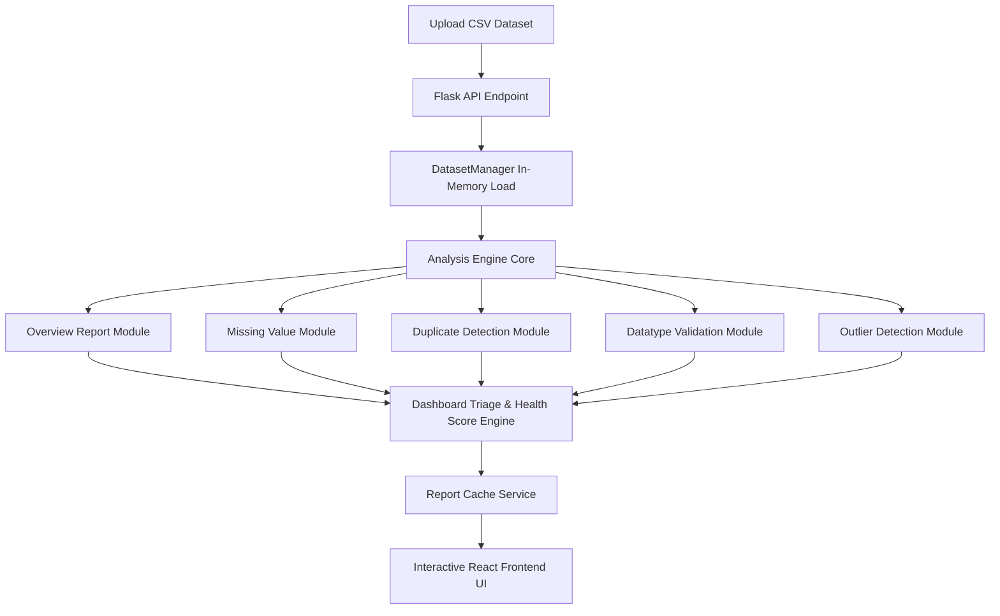

# 🔍 DataLens — Data Quality Impact Investigator

[](https://www.python.org/)
[](https://flask.palletsprojects.com/)
[](https://react.dev/)
[](https://vitejs.dev/)
[](LICENSE)

> An intelligent, full-stack data quality investigation platform that detects data anomalies, calculates composite dataset health scores, evaluates operational & financial risks, and delivers actionable business recommendations.

---

## 📖 Project Overview

Data quality issues are often silent productivity killers in data engineering and analytics pipelines. Most traditional data quality tools only present raw technical statistics, such as:

- *"Salary column has 8.3% missing values."*
- *"Dataset contains 12 duplicate rows."*

While these numbers describe the data state, they fail to answer the critical questions engineering and business teams face:

- **What is the operational impact of these issues?**
- **Which anomalies require immediate triage versus routine cleanup?**
- **What specific business risks could occur if this data enters production pipelines?**
- **How can these issues be resolved effectively?**

**DataLens** addresses this gap by acting as an automated **Data Quality Investigator**. Rather than simply reporting statistics, it evaluates dataset health holistically using a weighted scoring model, categorizes severity levels, estimates operational risks, and provides clear remediation guidance.

---

## ⚡ Key Features

- **🚀 One-Command Launcher (`python run.py`)**  
  Automates environment validation, virtual environment detection, dependency checks, and service startup for both Flask backend and React frontend with a single command.

- **📁 Dataset Upload & Live Inspection**  
  Supports CSV dataset uploads with automated schema detection, dataset size verification, and a live preview card before executing analysis.

- **📊 Comprehensive Dataset Overview**  
  Generates key metrics including dataset dimensions, numeric/categorical split, memory usage, missing counts, and overall data health rating.

- **⚠️ Missing Value Analysis**  
  Identifies missing values across all attributes, measures null percentages, calculates column-level severity, and outlines operational business impacts.

- **🔄 Duplicate Record Detection**  
  Detects duplicate entity rows, calculates dataset inflation rates, and presents dynamic sample duplicate pairs for inspection.

- **📐 Datatype Conformance Validation**  
  Compares detected datatypes against expected schema definitions to flag type mismatches, parsing warnings, and inconsistent data formats.

- **📈 Outlier & Anomaly Detection**  
  Uses Interquartile Range (IQR) statistical techniques to identify continuous numerical outliers, lower/upper bounds, and extreme values.

- **🎯 Severity Assessment & Recommendation Engine**  
  Categorizes issues into standardized severity levels (*Critical, High, Medium, Low, No Issue*) and provides specific remediation steps.

- **📊 Executive Master Dashboard**  
  Displays a Composite Health Score (0–100), dataset status (*Excellent, Good, Average, Poor, Critical*), priority triage queue, and quick insights summary.

---

## 🔄 Project Workflow



---

## 🏗 Project Architecture

```text
                               ┌───────────────────────────────┐
                               │     React / Vite Frontend     │
                               │     http://localhost:3000     │
                               └───────────────┬───────────────┘
                                               │
                                       REST APIs (JSON)
                                               │
                                               ▼
                               ┌───────────────────────────────┐
                               │       Flask REST Backend      │
                               │     http://127.0.0.1:5000     │
                               └───────────────┬───────────────┘
                                               │
                   ┌───────────────────────────┼───────────────────────────┐
                   ▼                           ▼                           ▼
       ┌───────────────────────┐   ┌───────────────────────┐   ┌───────────────────────┐
       │   Dataset Manager     │   │    Analysis Engine    │   │ Report Cache Service  │
       │  (In-Memory CSV Load) │   │ (Quality & Severity)  │   │  (In-Memory Caching)  │
       └───────────────────────┘   └───────────────────────┘   └───────────────────────┘
```

---

## 📊 Analysis Reports Summary

| Report Module | Focus & Methodology | Primary Outputs & Deliverables |
| :--- | :--- | :--- |
| **Dataset Overview** | High-level dataset profiling | Row/Column counts, memory footprint, attribute data split. |
| **Missing Values** | Null value distribution & ratio analysis | Missing counts, null percentages, severity, business impact callouts. |
| **Duplicate Records** | Entity row duplication check | Duplicate row count, dataset inflation rate %, sample duplicate entity pairs. |
| **Datatype Validation** | Schema type conformance analysis | Expected vs detected datatypes, invalid type count per attribute. |
| **Outlier Detection** | IQR (Interquartile Range) statistical filtering | Lower/upper bounds, outlier count, min/max continuous values. |
| **Master Dashboard** | Executive summary & issue triage | Health Score (0–100), dataset status, score breakdown, priority triage queue. |

---

## 🛠 Technology Stack

| Category | Technology | Usage & Purpose |
| :--- | :--- | :--- |
| **Backend** | Python 3.8+ | Core runtime environment |
| **Framework** | Flask 3.1 | Modular REST API service & routing blueprints |
| **Data Processing** | Pandas, NumPy | Dataset manipulation, IQR statistics, schema validation |
| **Frontend** | React 18, Vite 6 | Single Page Application (SPA) user interface |
| **Icons & Styling** | Lucide React, CSS3 | Data visualization icons & responsive layout design |
| **DevOps & Automation** | Python `subprocess`, `socket` | One-command launcher (`run.py`) and health checks |

---

## 📂 Repository Structure

```text
DataLens/
├── app.py                      # Flask REST Application Entry Point
├── run.py                      # One-Command Enterprise Launcher
├── main.py                     # CLI Demonstration Script
├── requirements.txt            # Python Dependencies
├── pyrightconfig.json          # Pyright Static Analysis Configuration
├── config/                     # Configuration Rules & Severity Matrices
│   ├── datatype_config.py
│   ├── severity.py
│   └── upload_config.py
├── engine/                     # Core Analysis Engine
│   └── analysis_engine.py
├── services/                   # Business Services & Quality Logic
│   ├── dashboard_service.py
│   ├── dataset_manager.py
│   ├── datatype_service.py
│   ├── outlier_service.py
│   ├── quality_service.py
│   ├── report_cache_service.py
│   └── upload_service.py
├── reports/                    # Report Generation Modules
│   ├── overview.py
│   ├── missing.py
│   ├── duplicate.py
│   ├── datatype.py
│   ├── outlier.py
│   └── dashboard.py
├── routes/                     # API Route Blueprints
│   └── api.py
├── data/
│   ├── raw/
│   └── sample/                 # Benchmark Sample Datasets
├── uploads/                    # Temporary File Storage
├── output/                     # Generated Demonstration Artifacts
└── frontend/                   # React/Vite Frontend Application
    ├── src/
    │   ├── components/         # Reusable Table & Card Components
    │   ├── context/            # Global DataLens State Provider
    │   ├── pages/              # Application View Pages
    │   └── services/           # Axios API Client Services
    ├── index.html
    ├── package.json
    └── vite.config.js
```

---

## 🚀 Quick Start & Installation

### Prerequisites

Ensure you have the following installed on your system:
- **Python** (version 3.8 or higher)
- **Node.js** (version 16 or higher) and **npm**

---

### Step 1: Clone the Repository

```bash
git clone https://github.com/Arman-mn-0312/DataLens.git
cd DataLens
```

---

### Step 2: Install Dependencies

#### Backend Dependencies
Create and activate a virtual environment, then install Python requirements:

```bash
python -m venv .venv

# On Windows:
.venv\Scripts\activate

# On macOS/Linux:
source .venv/bin/activate

pip install -r requirements.txt
```

#### Frontend Dependencies
Navigate to the `frontend` directory and install npm packages:

```bash
cd frontend
npm install
cd ..
```

---

### Step 3: Launch the Application (One Command)

From the project root directory, run the launcher:

```bash
python run.py
```

The launcher will automatically verify environment readiness, start the Flask backend on port `5000`, launch the React frontend on port `3000`, and open your default web browser to `http://localhost:3000`.

---

## 🖼 Screenshots

> *Placeholder section for interface screenshots.*

| Landing Page | Upload & Preview Page |
| :---: | :---: |
|  |  |

| Dataset Overview | Missing Values Report |
| :---: | :---: |
|  |  |

| Duplicate Records Report | Datatype Validation Report |
| :---: | :---: |
|  |  |

| Outlier Detection Report | Master Dashboard |
| :---: | :---: |
|  |  |

---

## 🎬 Product Demonstration

> *Placeholder section for demonstration GIF / Video.*


---

## 🗺 Planned Roadmap

Future feature enhancements planned for upcoming iterations:

- [ ] **🔐 User Authentication & Workspace Isolation**: Multi-tenant login and user workspace management.
- [ ] **🗄 SQL Database Connectors**: Direct connection to PostgreSQL, MySQL, and Snowflake data warehouses.
- [ ] **📄 Exportable PDF / Excel Reports**: Downloadable executive summary PDF reports.
- [ ] **☁ Cloud Deployment & Containerization**: Dockerized setup and Kubernetes deployment manifests.
- [ ] **📈 Historical Quality Trend Tracking**: Track quality score drift over time for scheduled dataset jobs.

---

## 👨‍💻 Author

**Arman Mansuri**  
*MCA Student | Data Science & Software Engineering Enthusiast*

- **GitHub**: [Arman-mn-0312](https://github.com/Arman-mn-0312)
- **LinkedIn**: [Arman Mansuri](https://linkedin.com/in/your-linkedin-profile) *(Update link as appropriate)*
- **Email**: `your-email@example.com` *(Update email as appropriate)*

---

## 📜 License

This project is licensed under the [MIT License](LICENSE) — see the LICENSE file for details.
